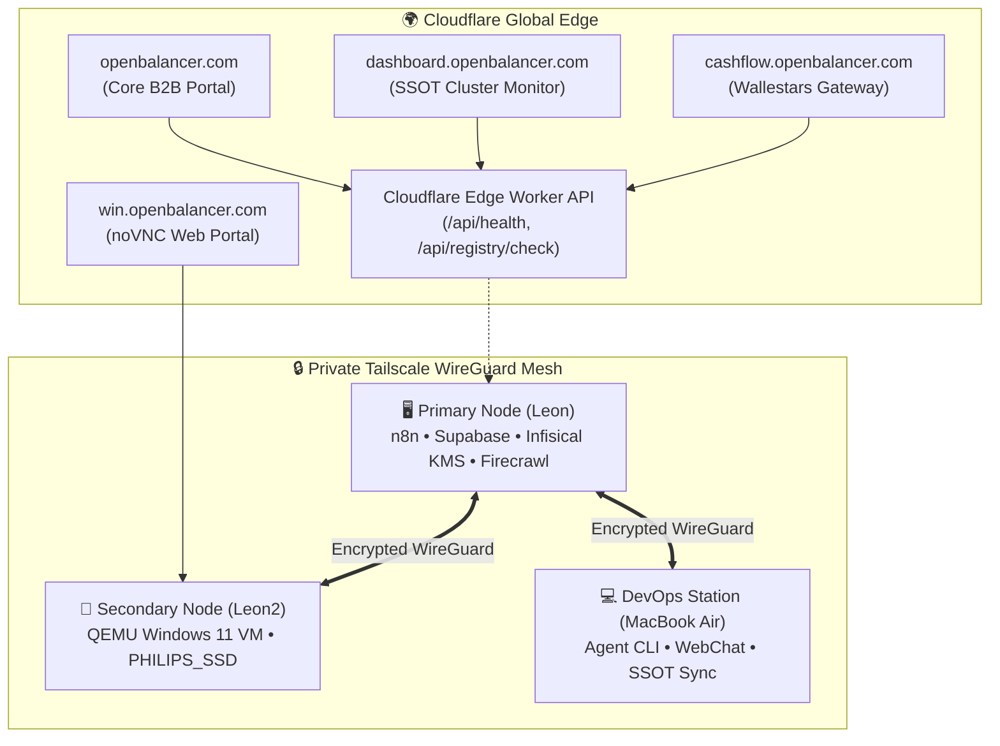

# ⚡ INCONTROL PLUS ЕООД
### Enterprise Fintech Infrastructure • Zero-Config Virtualization • Distributed Edge Mesh

 

  <b>INCONTROL PLUS ЕООД</b> engineers mission-critical fintech automation, distributed edge mesh networks, and zero-config headless virtualization systems for corporate clients in the EU.

[🌐 **Corporate Portal**](https://openbalancer.com) • [📊 **Cluster Telemetry**](https://dashboard.openbalancer.com) • [💳 **Fintech & Cashflow**](https://cashflow.openbalancer.com) • [🖥️ **Windows 11 Gateway**](https://win.openbalancer.com)

---

## 🏛️ Flagship Production Platforms

<table>
  <tr>
    <td width="50%" valign="top">
      <h3>📊 Open Balancer Telemetry Hub</h3>
      
Real-time SSOT infrastructure monitor overseeing a 10-node distributed cluster mesh, edge latencies, and SSL certificate lifecycles with WCAG 2.2 AAA dark glassmorphism.

      <ul>
        <li><b>Live SSOT:</b> <a href="https://dashboard.openbalancer.com">dashboard.openbalancer.com</a></li>
        <li><b>Source:</b> <a href="https://github.com/incontrolplus/openbalancer-dashboard"><code>incontrolplus/openbalancer-dashboard</code></a></li>
        <li><b>Stack:</b> React 18, TypeScript, Tailwind CSS, Vite, Cloudflare Pages</li>
      </ul>
    </td>
    <td width="50%" valign="top">
      <h3>🖥️ Portable Windows 11 QEMU VM</h3>
      
Automated zero-config portable Windows 11 virtual machine launcher with hardware requirement bypasses, noVNC browser gateway, and NFS byte-locking protection.

      <ul>
        <li><b>Live Gateway:</b> <a href="https://win.openbalancer.com">win.openbalancer.com</a></li>
        <li><b>Source:</b> <a href="https://github.com/incontrolplus/portable-windows-11-qemu"><code>incontrolplus/portable-windows-11-qemu</code></a></li>
        <li><b>Stack:</b> QEMU, websockify, noVNC, Bash, Apple Silicon TCG / HVF</li>
      </ul>
    </td>
  </tr>
  <tr>
    <td width="50%" valign="top">
      <h3>💳 Wallestars B2B Cashflow</h3>
      
B2B corporate card issuing framework, cashflow automation, and Bulgarian Commercial Register API beneficial ownership derivation with Mod 11 validation.

      <ul>
        <li><b>Live Gateway:</b> <a href="https://cashflow.openbalancer.com">cashflow.openbalancer.com</a></li>
        <li><b>Source:</b> <a href="https://github.com/incontrolplus/finans-protect-monorepo"><code>incontrolplus/finans-protect-monorepo</code></a></li>
        <li><b>Stack:</b> Node.js, Express, CompanyBook REST API, Supabase, Tailwind</li>
      </ul>
    </td>
    <td width="50%" valign="top">
      <h3>⚡ Open Balancer Core Reverse Proxy</h3>
      
High-throughput asynchronous reverse proxy and load balancer with active circuit breaking, Prometheus metrics export, and health check routing.

      <ul>
        <li><b>Live Edge:</b> <a href="https://openbalancer.com">openbalancer.com</a></li>
        <li><b>Source:</b> <a href="https://github.com/incontrolplus/openbalancer"><code>incontrolplus/openbalancer</code></a></li>
        <li><b>Stack:</b> Python, AsyncIO, Docker, Prometheus, Grafana (MIT)</li>
      </ul>
    </td>
  </tr>
</table>

---

## 🌐 Distributed Cluster Mesh Architecture

---

## 🛡️ Enterprise Security & Regulatory Compliance

- **Bulgarian Commercial Register Integration**: Live Mod 11 checksum verification for company identification numbers (ЕИК/Булстат) and automated beneficial owner share derivation (>= 50%).
- **National Revenue Agency (НАП) Accounting**: CP1251 byte-accurate sales/purchases VAT triplet export (`DEKLAR.TXT`, `POKUPKI.TXT`, `PRODAGBI.TXT`).
- **Zero CDN & Strict CSP Policy**: Complete elimination of runtime external scripts (`cdn.tailwindcss.com`, `unpkg.com`) with self-hosted assets to guarantee zero supply-chain vulnerabilities.
- **Two-Tier KMS Key Derivation**: AES-256-GCM secret management powered by self-hosted Infisical vaults across developer and production environments.

---

## 📞 Enterprise Inquiries & SLA Support

- **Operating Entity:** INCONTROL PLUS ЕООД
- **Headquarters:** Sofia, Republic of Bulgaria
- **Official Portal:** [https://openbalancer.com](https://openbalancer.com)
- **Corporate Email:** [incontrolplusltd@gmail.com](mailto:incontrolplusltd@gmail.com)
- **SLA Response Window:** < 2 Hours for Enterprise Retainer Partners

 

  © 2026 INCONTROL PLUS ЕООД. All rights reserved. Powered by Open Balancer.

